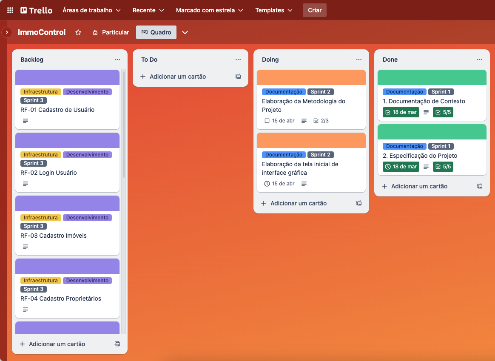
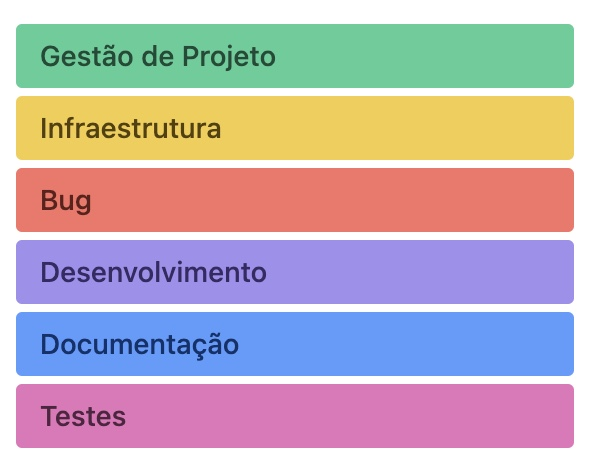

# Metodologia

## Gerenciamento de Projeto
A metodologia ágil escolhida para o desenvolvimento deste projeto foi o SCRUM, pois como citam Amaral, Fleury e Isoni (2019, p. 68), seus benefícios são a

“visão clara dos resultados a entregar; ritmo e disciplina necessários à execução; definição de papéis e responsabilidades dos integrantes do projeto (Scrum Owner, Scrum Master e Team); empoderamento dos membros da equipe de projetos para atingir o desafio; conhecimento distribuído e compartilhado de forma colaborativa; ambiência favorável para crítica às ideias e não às pessoas.”

### Divisão de Papéis

A equipe utiliza o Scrum como base para definição do processo de desenvolvimento.
- **Product Owner:** Zander Vasconcelos Pereira (responsável pela visão do que se vai construir ou entregar no projeto).
- **Scrum Master:** Pedro Francis Maia Coelho (orienta o restante da equipe em relação à estrutura de processos do Scrum).
- **Equipe de Desenvolvimento:** Sócratis Gomes da Silva, Ismarlei Magela de Jesus, Pedro Francis Maia Coelho, Zander Vasconcelos Pereira, Thássia Campos e Eduardo Wollinger (Constroem o projeto).
- **Equipe de Design:** Thássia Campos e Eduardo Wollinger (Constroem a arte gráfica do projeto).

### Processo

Para coordenar as atividades do projeto, a equipe está utilizando o Trello, organizado com as seguintes lista:
- Backlog: recebe as tarefas a serem trabalhadas e representa o Product Backlog. Todas as atividades identificadas no decorrer do projeto também devem ser incorporadas a esta lista. 
- To Do: Esta lista representa o Sprint Backlog. Este é o Sprint atual que estamos trabalhando. 
- Doing: Quando uma tarefa tiver sido iniciada, ela é movida para cá. 
- Done: nesta lista são colocadas as tarefas que passaram pelos testes e controle de qualidade e estão prontos para ser entregues ao usuário. Não há mais edições ou revisões necessárias, ele está agendado e pronto para a ação.

<figure> 
  Figura 1 - Tela do kanban no Trello utilizado pela equipe</figcaption>
</figure> 

### Etiquetas

As tarefas são, ainda, etiquetadas em função da natureza da atividade e seguem o seguinte esquema de cores/categorias:

<ul>
  <li>Bug</li>
  <li>Desenvolvimento</li>
  <li>Documentação</li>
  <li>Gerência de Projetos</li>
  <li>Infraestrutura</li>
  <li>Testes</li>
</ul>

<figure> 
  Figura 2 - Tela do esquema de cores e categorias</figcaption>
</figure> 
  
### Ferramentas

Os artefatos do projeto são desenvolvidos a partir de diversas plataformas e a relação dos ambientes com seu respectivo propósito é apresentada na tabela que se segue.

| AMBIENTE                            | PLATAFORMA                         | LINK DE ACESSO                         |
|-------------------------------------|------------------------------------|----------------------------------------|
| Repositório de código fonte         | GitHub                             |https://github.com/ICEI-PUC-Minas-PMV-ADS/pmv-ads-2024-1-e1-proj-web-t6-pmv-ads-2024-1-e1-projeto_locacao/tree/main/codigo-fonte
| Documentos do projeto               | GitHub                             |https://github.com/ICEI-PUC-Minas-PMV-ADS/pmv-ads-2024-1-e1-proj-web-t6-pmv-ads-2024-1-e1-projeto_locacao/tree/main/documentos|
| Projeto de Interface                | Figma                              | [https://www.figma.com/team_invite/redeem/0ETx6KVF93fEeunJGVlMtP](https://www.figma.com/file/zac3bVNn9DumfTtFSRHic0/Untitled?type=design&node-id=0-1&mode=design&t=FSsYY4Mc4fuMjiTW-0) |
| Gerenciamento do Projeto            | Trello                             |https://trello.com/b/Q8BMQ3Oi/immocontrol
| Hospedagem                          | GitHub Pages                       |      a definir                                  |

### Estratégia de Organização de Codificação 

Todos os artefatos relacionados a implementação e visualização dos conteúdos do projeto do site deverão ser inseridos na pasta [codigo-fonte](https://github.com/ICEI-PUC-Minas-PMV-ADS/pmv-ads-2024-1-e1-proj-web-t6-pmv-ads-2024-1-e1-projeto_locacao/tree/main/codigo-fonte). Consulte também a nossa sugestão referente a estratégia de organização de codificação a ser adotada pela equipe de desenvolvimento do projeto.
