# Projeto de Interface

### User Flow 

O fluxograma abaixo mostra o fluxo de interação do usuário pelas telas do sistema. As telas do sistema são detalhadas na seção de Protótipo de baixa fidelidade.

<figure> 
  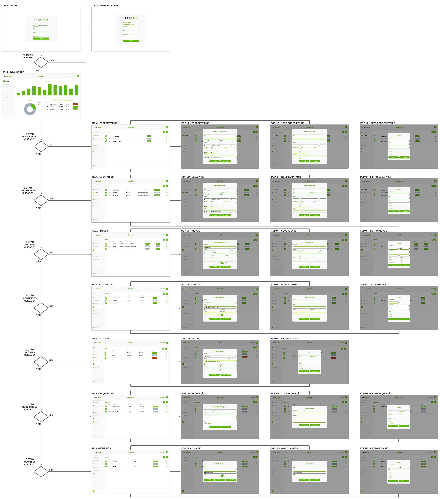Figura 1 - User Flow - ImmoControl</figcaption>
</figure>

--------------------------------------------------------------------------------------------------------------------

### Protótipo de baixa fidelidade

As telas do sistema seguem um único padrão, o qual é representado pela figura 2 e constituído pelos blocos descritos abaixo:

* Cabeçalho - A esquerda encontra-se a logo, ao centro encontra-se o nome da página e a direita encontra-se o nome do usuário autenticado no sistema.
* Sidebar - Encontra-se os botões responsáveis pelo roteamento das páginas.
* Conteúdo - Encontra-se o conteúdo da tela em vizualização.
  
<figure> 
  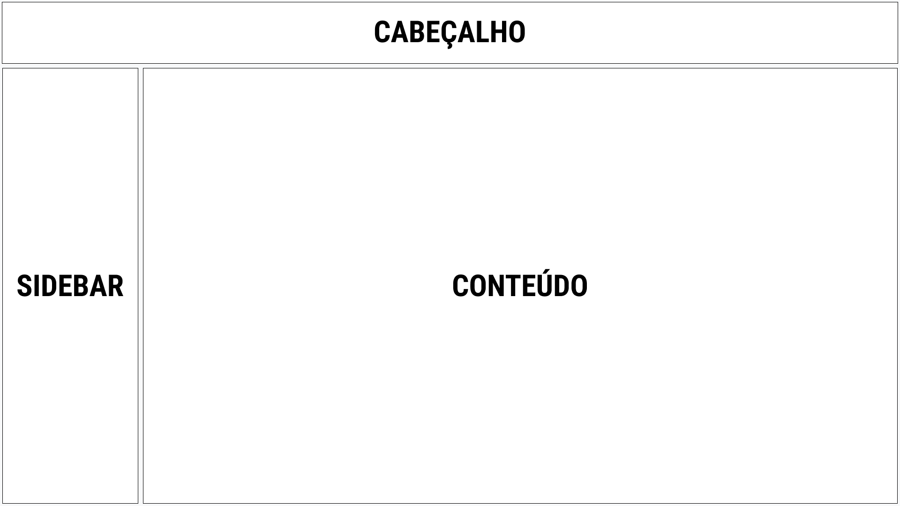Figura 2 - Estrutura Padrão das Páginas</figcaption>
</figure>

--------------------------------------------------------------------------------------------------------------------

### Tela - Login
A tela de Login apresenta campos para a inserção do e-mail e da senha, e a funcionalidade de manter-se logado.
<figure> 
  Figura 3 - Tela - Acesso à conta de usuário</figcaption>
</figure>

--------------------------------------------------------------------------------------------------------------------

### Tela - Primeiro Acesso
A tela de Primeiro Acesso apresenta os campos de senha antiga, senha e confirmar senha para que seja realizada a alteração da senha originalmente gerada pelo sistema.
<figure> 
  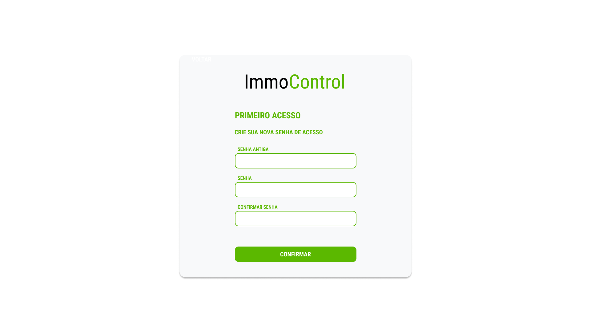Figura 4 - Tela - Atualização da senha de acesso</figcaption>
</figure>

--------------------------------------------------------------------------------------------------------------------

### Tela - Dashboard
A tela de dashboard apresenta informações relevântes e de rápida visualização em forma de resumo do faturamento mensal, vacância física e vacância financeira.
<figure> 
  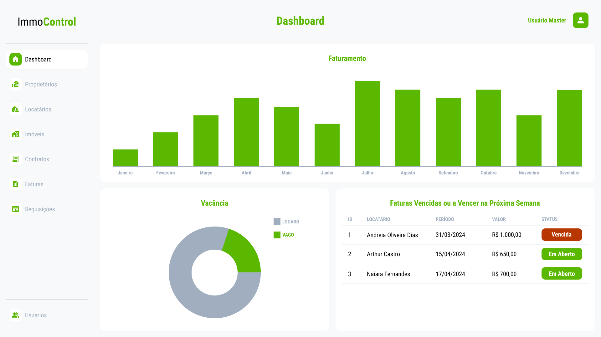Figura 5 - Tela - Dashboard</figcaption>
</figure>

--------------------------------------------------------------------------------------------------------------------

### Tela - Proprietários
A tela de proprietários apresenta informações resumidas de todos os proprietários cadastrados como Id, Nome, Imóveis e Status de cada um deles.
<figure> 
  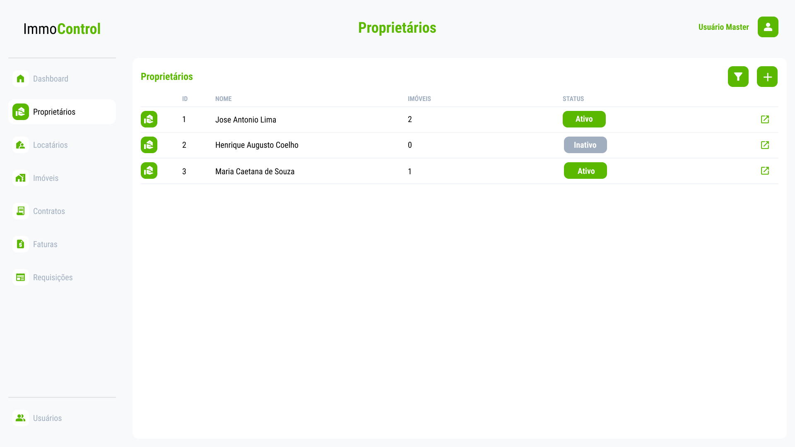Figura 6 - Tela - Proprietários</figcaption>
</figure>

--------------------------------------------------------------------------------------------------------------------

Ao clicar no botão do lado direito de cada linha da tabela na tela de proprietários apresenta em seguida um Pop-up das informações pessoais dos mesmos já previamente cadastrados no sistema como: Nome Completo, CPF, Estado Civil, Endereço, Telefone e E-mail.
<figure> 
  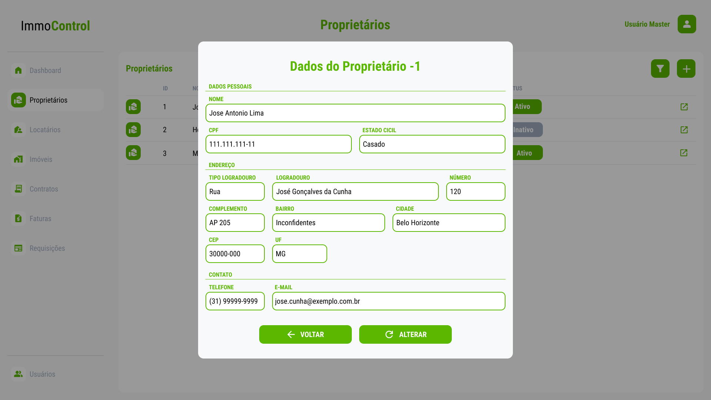Figura 7 - Pop-up - Proprietário cadastrado</figcaption>
</figure>

--------------------------------------------------------------------------------------------------------------------

Ao clicar no botão adicionar(+) na tela de proprietários apresenta em seguida um Pop-up com os seguintes campos para inserção das informações pessoais de um novo proprietário como: Nome Completo, CPF, Estado Civil, Endereço, Telefone e E-mail.
<figure> 
  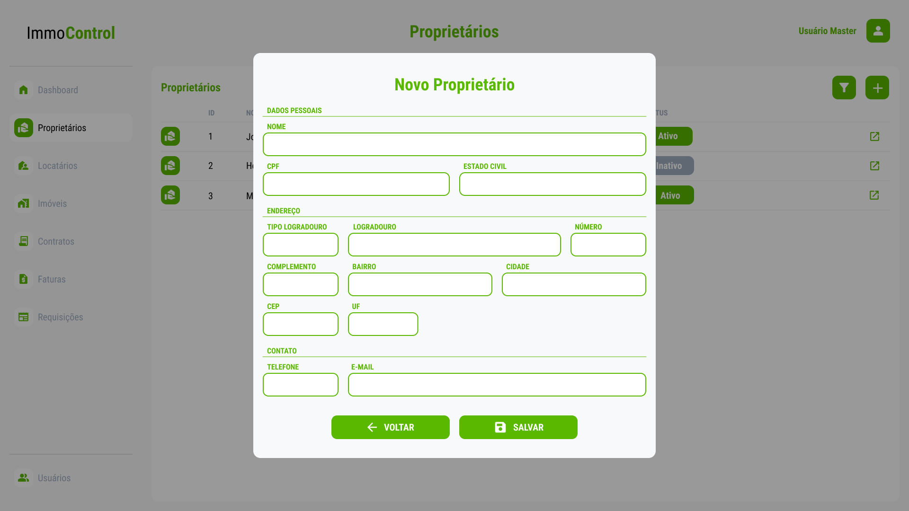Figura 8 - Pop-up - Cadastro de Proprietário</figcaption>
</figure>

--------------------------------------------------------------------------------------------------------------------

Ao clicar no botão filtro na tela de proprietários apresenta em seguida um Pop-up com os campos Id, Nome CPF e Status, afim de filtrar e visualizar as informações de determinado(s) proprietário(s) cadastrado(s).
<figure> 
  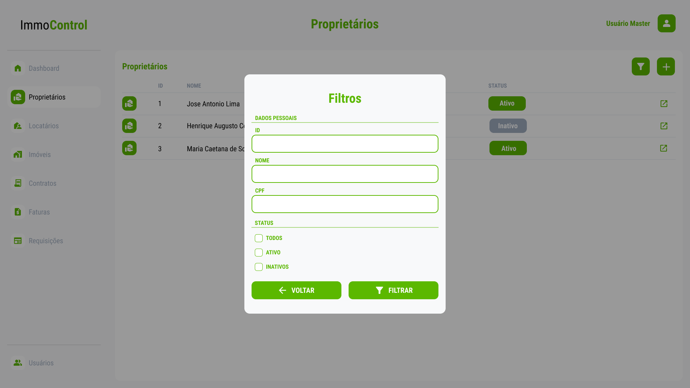Figura 9 - Pop-up - Filtro de Proprietário(s)</figcaption>
</figure>

--------------------------------------------------------------------------------------------------------------------

### Tela - Locatário
A tela de locatários apresenta informações resumidas de todos os locatários cadastrados como Id, Telefone, E-mail e Status de cada um deles.

<figure> 
  Figura 9 - Tela - Locatário</figcaption>
</figure>

Ao clicar no botão do lado direito de cada linha da tabela na tela de locatários apresenta em seguida um Pop-up das informações detalhadas dos mesmos já previamente cadastrados no sistema como: Nome Completo, CPF, Estado Civil, Endereço, Telefone e E-mail.
<figure> 
  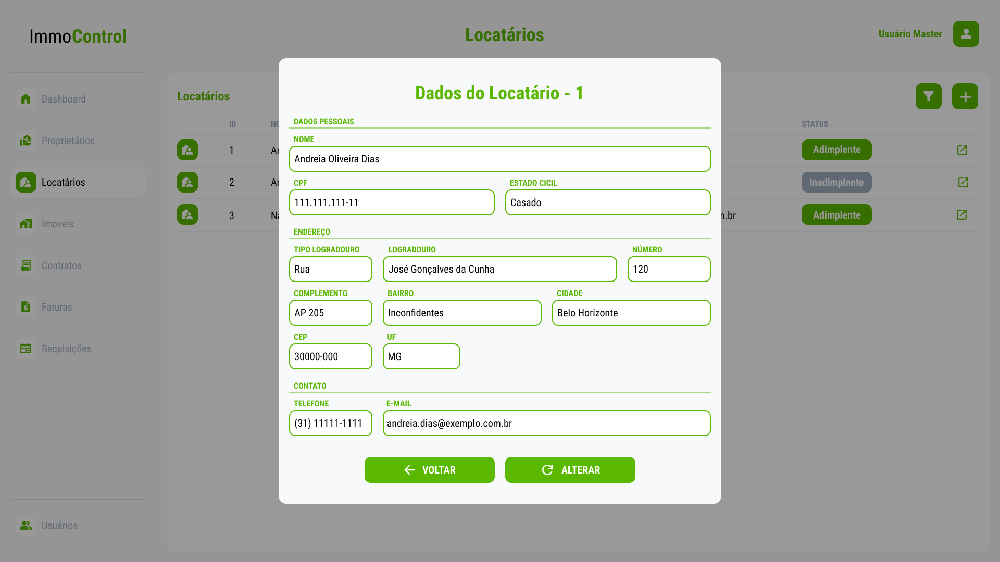Figura 10 - Pop-up - Locatário cadastrado</figcaption>
</figure>

Ao clicar no botão adicionar(+) na tela de locatários apresenta em seguida um Pop-up com os seguintes campos para inserção das informações pessoais de um novo locatários Nome Completo, CPF, Estado Civil, Endereço, Telefone e E-mail.

<figure> 
  Figura 11 - Pop-up - Locatário Novo</figcaption>
</figure>

### Tela - Imóveis (ZANDER)
<figure> 
  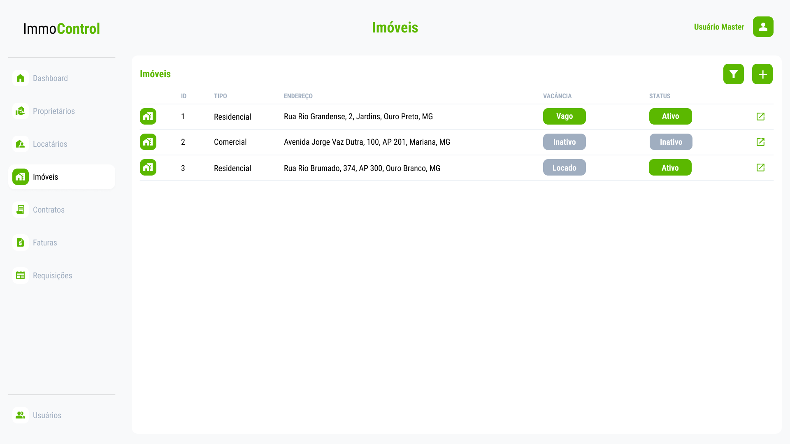Figura 12 - Tela - Imóveis</figcaption>
</figure> 

### Pop Up - Imóvel (ZANDER)
<figure> 
  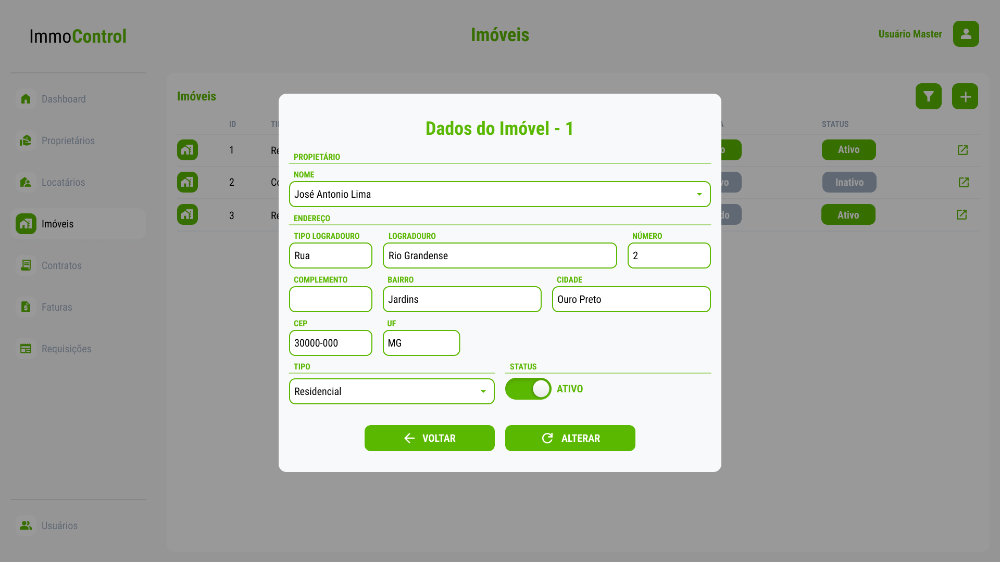Figura 13 - Tela - Pop up Imóvel</figcaption>
</figure> 

### Pop Up - Novo Imóvel (ZANDER)

<figure> 
  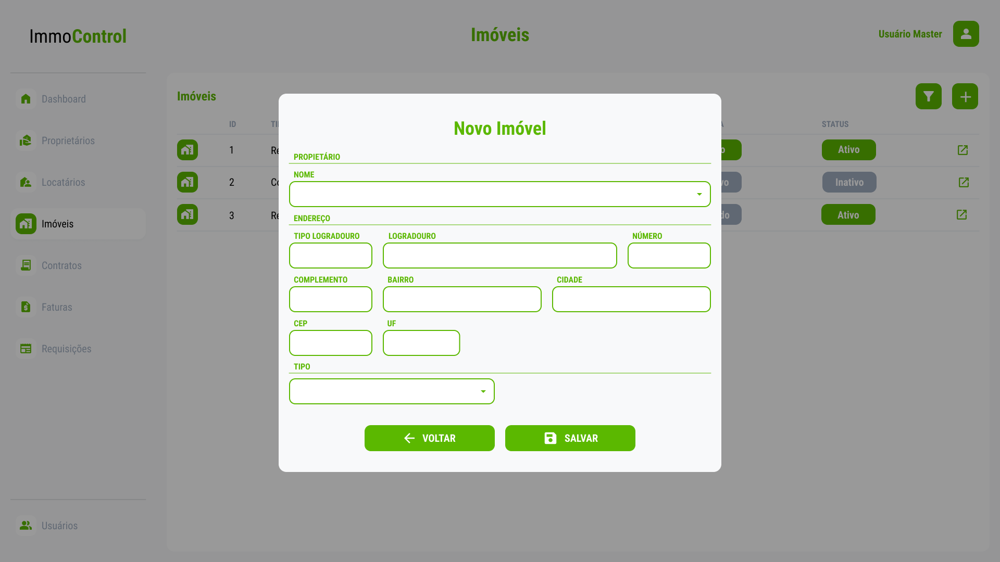Figura 14 - Tela - Pop up novo imóvel</figcaption>
</figure> 

### Tela - Contratos (ZANDER)

Figura 15

### Pop Up - Contrato (ZANDER)

Figura 16

### Pop Up - Novo Contrato (ZANDER)

Figura 17

### Tela - Faturas (EDUARDO)

Figura 18

### Pop Up - Fatura (EDUARDO)

Figura 19

### Tela - Requisições (ISMARLEI)

Figura 20

### Pop Up - Requisição (ISMARLEI)

Figura 21

### Pop Up - Nova Requisição (ISMARLEI)

Figura 22

### Tela - Usuários (THASSIA)

Figura 23

### Pop Up - Usuário (THASSIA)

Figura 24

### Pop Up - Novo Usuário (THASSIA)

Figura 25

