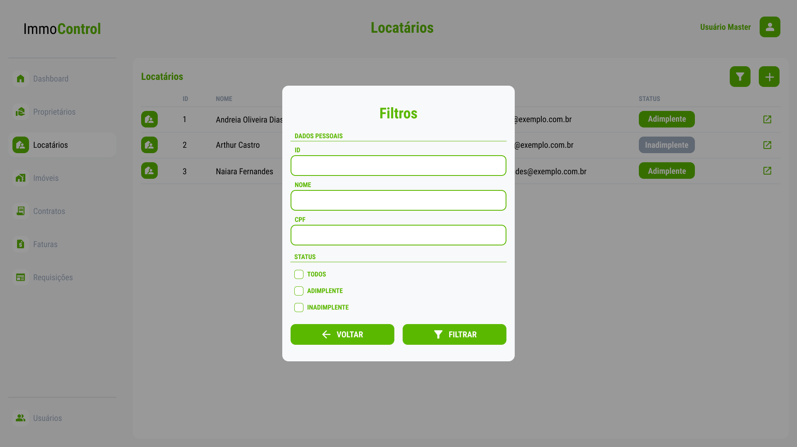
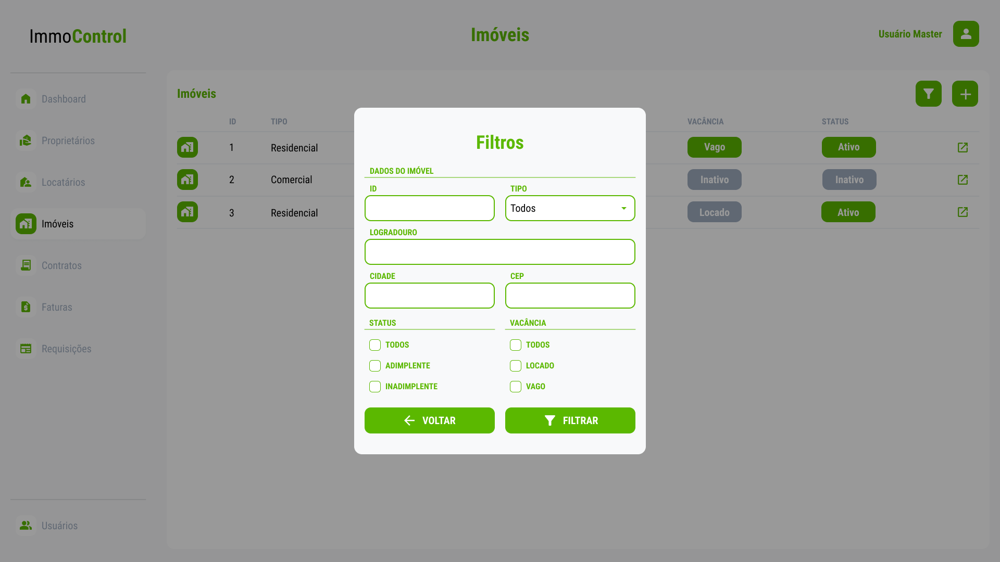
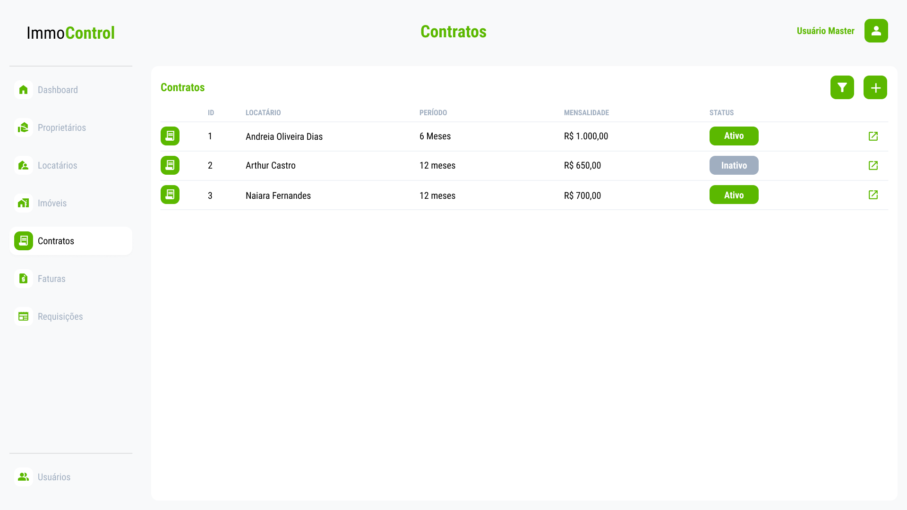
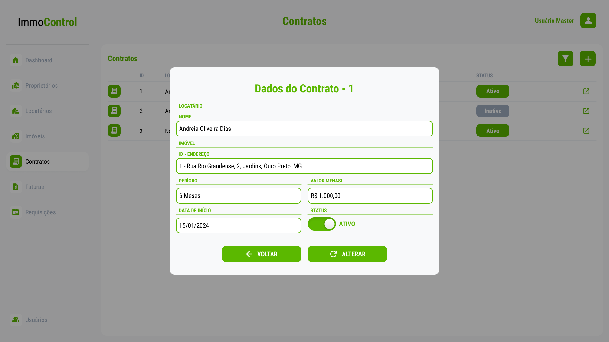
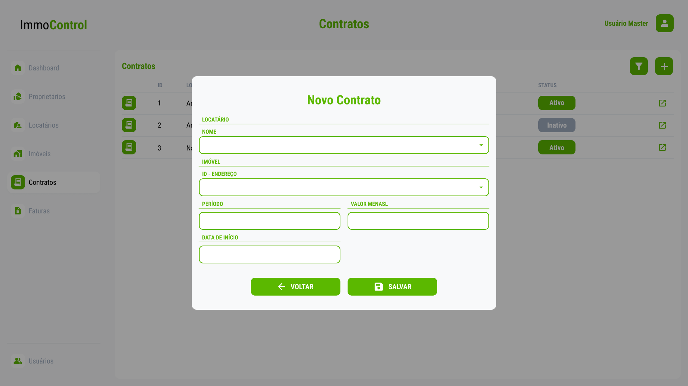
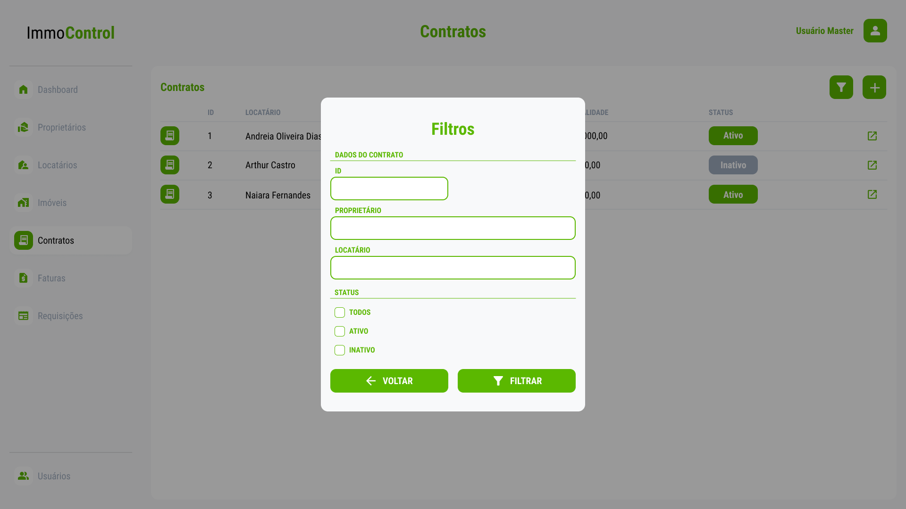
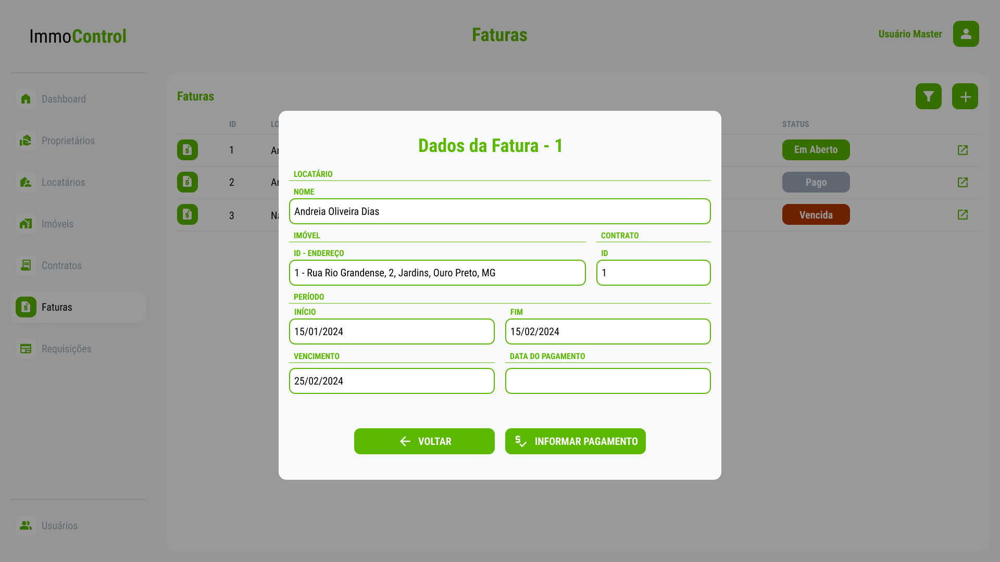
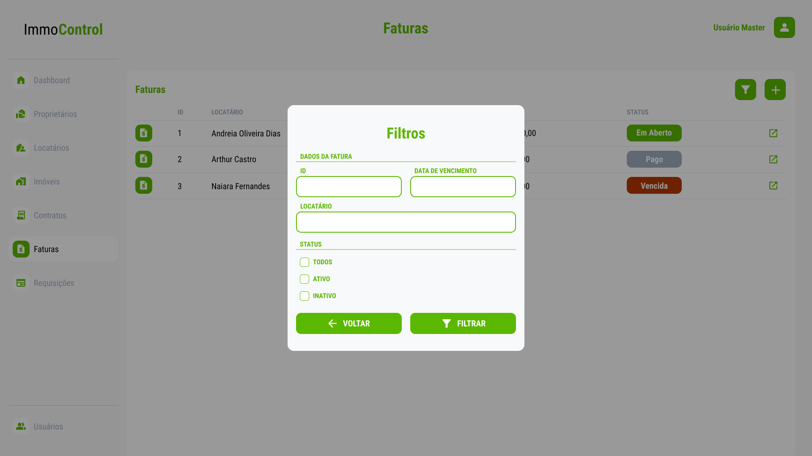

# Projeto de Interface

### User Flow 

O fluxograma abaixo mostra o fluxo de interação do usuário pelas telas do sistema. As telas do sistema são detalhadas na seção de Protótipo de baixa fidelidade.

<figure> 
  Figura 1 - User Flow - ImmoControl</figcaption>
</figure>

--------------------------------------------------------------------------------------------------------------------

### Protótipo de baixa fidelidade

As telas do sistema seguem um único padrão, o qual é representado pela figura 2 e constituído pelos blocos descritos abaixo:

* Cabeçalho - A esquerda encontra-se a logo, ao centro encontra-se o nome da página e a direita encontra-se o nome do usuário autenticado no sistema.
* Sidebar - Encontra-se os botões responsáveis pelo roteamento das páginas.
* Conteúdo - Encontra-se o conteúdo da tela em vizualização.
  
<figure> 
  Figura 2 - Estrutura Padrão das Páginas</figcaption>
</figure>

--------------------------------------------------------------------------------------------------------------------

### Tela - Login
A tela de Login apresenta campos para a inserção do e-mail e da senha, e a funcionalidade de manter-se logado.
<figure> 
  Figura 3 - Tela - Acesso à conta de usuário</figcaption>
</figure>

--------------------------------------------------------------------------------------------------------------------

### Tela - Primeiro Acesso
A tela de Primeiro Acesso apresenta os campos de senha antiga, senha e confirmar senha para que seja realizada a alteração da senha originalmente gerada pelo sistema.
<figure> 
  Figura 4 - Tela - Atualização da senha de acesso</figcaption>
</figure>

--------------------------------------------------------------------------------------------------------------------

### Tela - Dashboard
A tela de dashboard apresenta informações relevântes e de rápida visualização em forma de resumo do faturamento mensal, vacância física e vacância financeira.
<figure> 
  Figura 5 - Tela - Dashboard</figcaption>
</figure>

--------------------------------------------------------------------------------------------------------------------

### Tela - Proprietários
A tela de proprietários apresenta informações resumidas de todos os proprietários cadastrados como Id, Nome, Imóveis e Status de cada um deles.
<figure> 
  Figura 6 - Tela - Proprietários</figcaption>
</figure>

--------------------------------------------------------------------------------------------------------------------

Ao clicar no botão do lado direito de cada linha da tabela na tela de proprietários apresenta em seguida um Pop-up das informações pessoais dos mesmos já previamente cadastrados no sistema como: Nome Completo, CPF, Estado Civil, Endereço, Telefone e E-mail.
<figure> 
  Figura 7 - Pop-up - Proprietário Detalhes</figcaption>
</figure>

--------------------------------------------------------------------------------------------------------------------

Ao clicar no botão adicionar(+) na tela de proprietários apresenta em seguida um Pop-up com os seguintes campos para inserção das informações pessoais de um novo proprietário como: Nome Completo, CPF, Estado Civil, Endereço, Telefone e E-mail.
<figure> 
  Figura 8 - Pop-up - Cadastro de Proprietário</figcaption>
</figure>

--------------------------------------------------------------------------------------------------------------------

Ao clicar no botão filtro na tela de proprietários apresenta em seguida um Pop-up com os campos Id, Nome CPF e Status, afim de filtrar e visualizar as informações de determinado(s) proprietário(s) cadastrado(s).
<figure> 
  Figura 9 - Pop-up - Filtro de Proprietário(s)</figcaption>
</figure>

--------------------------------------------------------------------------------------------------------------------

### Tela - Locatário
A tela de locatários apresenta informações resumidas de todos os locatários cadastrados como Id, Telefone, E-mail e Status de cada um deles.

<figure> 
  Figura 10 - Tela - Locatário</figcaption>
</figure>

--------------------------------------------------------------------------------------------------------------------
### Pop-up - Locatário Detalhes
Ao clicar no botão do lado direito de cada linha da tabela na tela de locatários apresenta em seguida um Pop-up das informações detalhadas dos mesmos já previamente cadastrados no sistema como: Nome Completo, CPF, Estado Civil, Endereço, Telefone e E-mail.
<figure> 
  Figura 11 - Pop-up - Locatário Detalhes</figcaption>
</figure>

--------------------------------------------------------------------------------------------------------------------
### Pop-up - Cadastrar Novo Locatário
Ao clicar no botão adicionar(+) na tela de locatários apresenta em seguida um Pop-up com os seguintes campos para inserção das informações pessoais de um novo locatários Nome Completo, CPF, Estado Civil, Endereço, Telefone e E-mail.

<figure> 
  Figura 12 - Pop-up - Locatário Novo</figcaption>
</figure>

--------------------------------------------------------------------------------------------------------------------

### Pop-up - Filtro Locatário
Ao clicar no botão filtro na tela de Locatários surge um Pop-up com os seguintes para inserção dos filtros possíveis (ID, Nome, CPF, Status - Todos, Ativo, Inativo). 

<figure> 
  Figura 13 - Pop-up - Locatário Filtro</figcaption>
</figure>

Ao clicar em "Filtrar" retorna-se à tela anterior (Locatários´) apresentando apenas as informações correspondentes aos filtros informados.

--------------------------------------------------------------------------------------------------------------------

### Tela - Imóveis 
Ao clicar na tela de imóveis é possível ter uma visão geral de todos os imóveis existentes no sistema, identificando o status de locação e se o cadastro ainda está ativo na imobiliária.
<figure> 
  Figura 14 - Tela - Imóveis</figcaption>
</figure> 

--------------------------------------------------------------------------------------------------------------------

### Pop Up - Imóvel 
Ao clicar no botão do lado direito em imóveis é possivel fazer a alteração dos dados do imóvel, se necessário atualizar.
<figure> 
  Figura 15 - Tela - Pop up Imóvel Detalhes</figcaption>
</figure> 

--------------------------------------------------------------------------------------------------------------------

### Pop Up - Novo Imóvel 
Ao clicar no "mais" acima da tela de imóveis, é possível cadastrar um novo imóvel.
<figure> 
  Figura 16 - Tela - Pop up novo imóvel</figcaption>
</figure> 

--------------------------------------------------------------------------------------------------------------------

### Pop Up - Filtro Imóvel 
Ao clicar no "funil" acima da tela de imóveis, é possível filtrar um imóvel dentro dos disponíveis.
<figure> 
  Figura 17 - Tela -Filtro Imóveis</figcaption>
</figure> 

--------------------------------------------------------------------------------------------------------------------

### Tela - Contratos 
Ao clicar no ícone "Contratos" é possível visualizar os contratos ativos, inativos, validade do contrato e mensalidade a ser paga.
<figure> 
  Figura 18 - Tela - COntratos</figcaption>
</figure> 

--------------------------------------------------------------------------------------------------------------------

### Pop Up - Contrato Detalhes 
Ao clicar no botão do lado direito ao lado de algum contrato é possivel fazer a alteração dos dados do Contrato.
<figure> 
  Figura 19 - Tela - Detalhes de contrato</figcaption>
</figure> 

--------------------------------------------------------------------------------------------------------------------

### Pop Up - Novo Contrato
Ao clicar no "mais" acima da tela de Contratos, é possível cadastrar um novo Contrato.
<figure> 
  Figura 20 - Tela - Novo contrato</figcaption>
</figure> 

--------------------------------------------------------------------------------------------------------------------

### Pop Up - Contrato Filtro
Ao clicar no "funil" acima da tela de Contratos, é possível filtrar contrato dentro dos disponíveis.
<figure> 
  Figura 21 - Tela - Filtro de contratos</figcaption>
</figure> 

--------------------------------------------------------------------------------------------------------------------

### Tela - Faturas
A tela de faturas apresenta informações resumidas de todas as faturas geradas como ID, Nome do Locatário, Valor e Status de cada uma.

<figure> 
  Figura 22 - Tela - Faturas</figcaption>
</figure> 

--------------------------------------------------------------------------------------------------------------------
### Pop-Up - Fatura Detalhes
Ao clicar no botão ao lado direito de cada linha da tabela na tela de faturas é apresenta em seguida uma Pop-up das informações daquela fatura: Nome do Locatário, Endereço de Cobrança, ID do Contrato, Datas de Início e Fim da Vigência do Contrato e de Vencimento e Pagamento.

<figure> 
  Figura 23 - Pop-up - Faturas Detalhes</figcaption>
</figure> 

--------------------------------------------------------------------------------------------------------------------

### Pop-Up - Fatura Filtro
Ao clicar no botão filtro na tela de fatura surge em seguida um Pop-up com os seguintes campos para inserção dos filtros possíveis (ID, Data Vencimento, Nome do Locatário, Status - Todos, Ativo, Inativo).

<figure> 
  Figura 24 - Pop-up - Faturas Filtro </figcaption>
</figure> 

Ao clicar em "Filtrar" retorna-se à tela anterior (Faturas) apresentando apenas as informações correspondentes aos filtros informados.

--------------------------------------------------------------------------------------------------------------------

### Tela - Requisições (ISMARLEI)

Figura 25

--------------------------------------------------------------------------------------------------------------------

### Pop Up - Requisição Detalhes (ISMARLEI)

Figura 26

--------------------------------------------------------------------------------------------------------------------

### Pop Up - Nova Requisição (ISMARLEI)

Figura 27

--------------------------------------------------------------------------------------------------------------------

### Pop Up - Filtro Requisição (ISMARLEI)

Figura 28

--------------------------------------------------------------------------------------------------------------------

### Tela - Usuários (THASSIA)

Figura 29

--------------------------------------------------------------------------------------------------------------------

### Pop Up - Usuário Detalhes (THASSIA)

Figura 30

--------------------------------------------------------------------------------------------------------------------

### Pop Up - Novo Usuário (THASSIA)

Figura 31

--------------------------------------------------------------------------------------------------------------------

### Pop Up - Usuário Filtro (THASSIA)

Figura 32

--------------------------------------------------------------------------------------------------------------------

