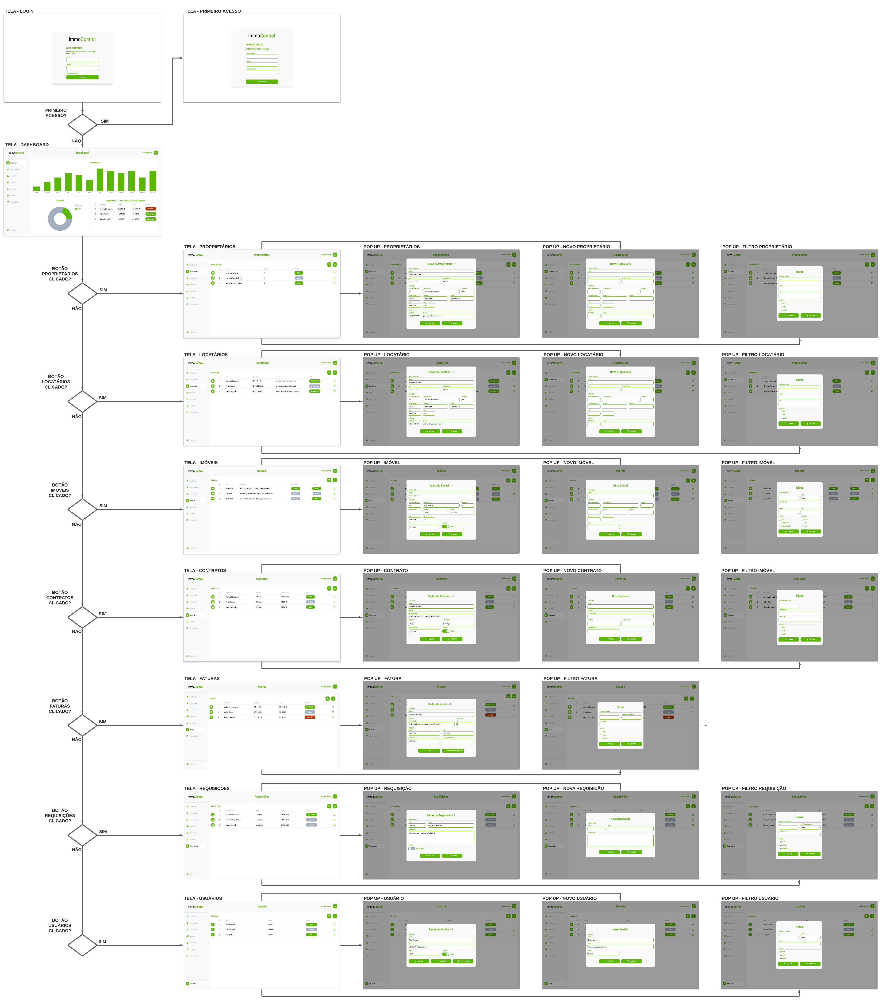

# Projeto de Interface

### User Flow (PEDRO)
<figure> 
  Figura 1 - User Flow - ImmoControl</figcaption>
</figure> 

Fluxo de usuário (User Flow) é uma técnica que permite ao desenvolvedor mapear todo fluxo de navegação do usuário na aplicação. Essa técnica funciona para alinhar os caminhos e as possíveis ações que o usuário pode fazer junto com os membros de sua equipe.

[Adicione aqui o diagrama de fluxo de usuário da sua aplicação.] 

> **Links Úteis**:
> - [User Flow: O Quê É e Como Fazer?](https://medium.com/7bits/fluxo-de-usu%C3%A1rio-user-flow-o-que-%C3%A9-como-fazer-79d965872534)
> - [User Flow vs Site Maps](http://designr.com.br/sitemap-e-user-flow-quais-as-diferencas-e-quando-usar-cada-um/)
> - [Top 25 User Flow Tools & Templates for Smooth](https://www.mockplus.com/blog/post/user-flow-tools)

### Protótipo

Desenvolver um protótipo emerge como uma das maneiras mais ágeis e econômicas de validar uma ideia, conceito ou funcionalidade. Isso permite a interação, avaliação, modificação e aprovação das principais características de uma interface antes de entrar na fase de desenvolvimento. Leia o artigo [Protótipos: baixa, média ou alta fidelidade?](https://medium.com/ladies-that-ux-br/prot%C3%B3tipos-baixa-m%C3%A9dia-ou-alta-fidelidade-71d897559135).

### Protótipo de baixa fidelidade (PEDRO)

Figura 2

Protótipos de baixa fidelidade apresentam de forma simplificada o design da interface e o relacionamento entre suas páginas, permitindo evolução da proposta da solução. Neste projeto, os utilizaremos para apoiar a validação dos requisitos e efetuar mudanças dos mesmos, caso seja necessário, para menor impacto na codificação da aplicação.

[Elabore as principais interfaces gráficas da aplicação de modo que os requisitos funcionais sejam contemplados nas telas propostas.]

[Adicione aqui as telas da sua aplicação com seus devidos títulos.] 
 
> **Links Úteis**:
> - [Protótipos vs Wireframes](https://www.nngroup.com/videos/prototypes-vs-wireframes-ux-projects/)
>- Ferramentas:
>> - [Pencil](https://pencil.evolus.vn/)
>> - [MarvelApp](https://marvelapp.com/)
>> - [Figma](https://www.figma.com/)

### Tela - Login (SOCRATIS) 
A tela de Login apresenta campos para a inserção do e-mail e da senha, e a funcionalidade de manter-se logado.

Figura 3 - Tela de acesso à conta de usuário

### Tela - Primeiro Acesso (SOCRATIS)
A tela de Primeiro Acesso apresenta os campos de senha antiga, senha e confirmar senha para que seja realizada a alteração da senha originalmente gerada pelo sistema.

Figura 4 - Tela de atualização da senha de acesso a conta de usuário

### Tela - Dashboard (SOCRATIS)
A tela de dashboard apresenta informações relevântes e de rápida visualização em forma de resumo do faturamento mensal, vacância física e vacância financeira.

Figura 5 - Tela Dashboard

### Tela - Proprietários (SOCRATIS)

Figura 6

### Pop Up - Proprietário (SOCRATIS)

Figura 7

### Pop Up - Novo Proprietário (SOCRATIS)

Figura 8

### Tela - Locatário (EDUARDO)

Figura 9

### Pop Up - Locatário (EDUARDO)

Figura 10

### Pop Up - Novo Locatário (EDUARDO)

Figura 11

### Tela - Imóveis (ZANDER)

Figura 12

### Pop Up - Imóvel (ZANDER)

Figura 13

### Pop Up - Novo Imóvel (ZANDER)

Figura 14

### Tela - Contratos (ZANDER)

Figura 15

### Pop Up - Contrato (ZANDER)

Figura 16

### Pop Up - Novo Contrato (ZANDER)

Figura 17

### Tela - Faturas (EDUARDO)

Figura 18

### Pop Up - Fatura (EDUARDO)

Figura 19

### Tela - Requisições (ISMARLEI)

Figura 20

### Pop Up - Requisição (ISMARLEI)

Figura 21

### Pop Up - Nova Requisição (ISMARLEI)

Figura 22

### Tela - Usuários (THASSIA)

Figura 23

### Pop Up - Usuário (THASSIA)

Figura 24

### Pop Up - Novo Usuário (THASSIA)

Figura 25

