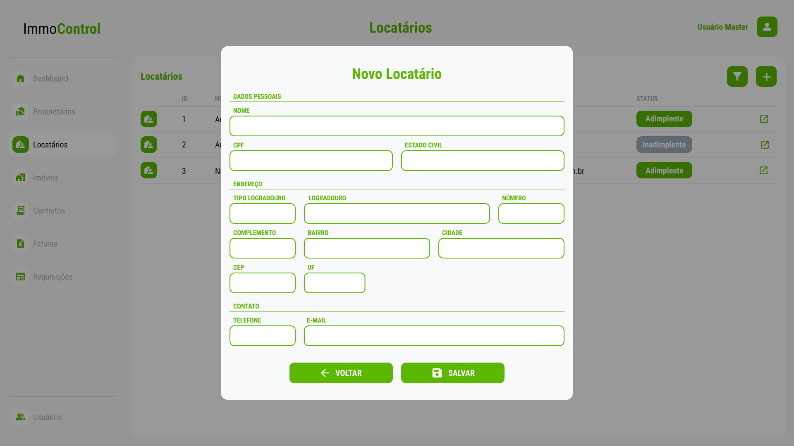
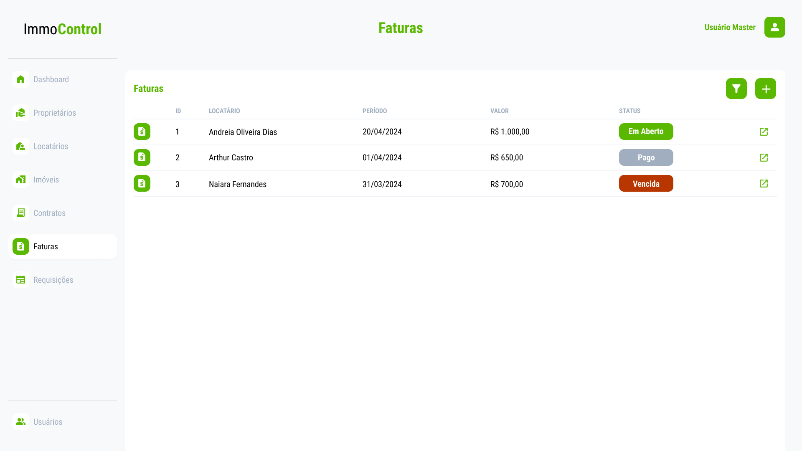

# Projeto de Interface

### User Flow 

O fluxograma abaixo mostra o fluxo de interação do usuário pelas telas do sistema. As telas do sistema são detalhadas na seção de Protótipo de baixa fidelidade.

<figure> 
  Figura 1 - User Flow - ImmoControl</figcaption>
</figure>

--------------------------------------------------------------------------------------------------------------------

### Protótipo de baixa fidelidade

As telas do sistema seguem um único padrão, o qual é representado pela figura 2 e constituído pelos blocos descritos abaixo:

* Cabeçalho - A esquerda encontra-se a logo, ao centro encontra-se o nome da página e a direita encontra-se o nome do usuário autenticado no sistema.
* Sidebar - Encontra-se os botões responsáveis pelo roteamento das páginas.
* Conteúdo - Encontra-se o conteúdo da tela em vizualização.
  
<figure> 
  Figura 2 - Estrutura Padrão das Páginas</figcaption>
</figure>

--------------------------------------------------------------------------------------------------------------------

### Tela - Login
A tela de Login apresenta campos para a inserção do e-mail e da senha do usuário. Apresenta também o botão entrar(caso o usuário informe credenciais váridas é encaminhado para a Tela Dashboard) e o link esqueceu a senha.
<figure> 
  Figura 3 - Tela - Login</figcaption>
</figure>

--------------------------------------------------------------------------------------------------------------------

### Tela - Primeiro Acesso
A tela de Primeiro Acesso apresenta os campos de senha antiga, senha e confirmar senha para que seja realizada a alteração da senha originalmente gerada pelo sistema. Apresenta também o botão confirmar(verifica a nova senha criada e encaminha o usuário para a Tela Dashboard).
<figure> 
  Figura 4 - Tela - Primeiro Acesso</figcaption>
</figure>

--------------------------------------------------------------------------------------------------------------------

### Tela - Dashboard
A tela de dashboard apresenta informações relevântes e de rápida visualização em forma de resumo do faturamento mensal, vacância física e faturas.
<figure> 
  Figura 5 - Tela - Dashboard</figcaption>
</figure>

--------------------------------------------------------------------------------------------------------------------

### Tela - Proprietários
A tela de proprietários apresenta informações resumidas de todos os proprietários cadastrados como id, nome, imóveis e status de cada um deles.
<figure> 
  Figura 6 - Tela - Proprietários</figcaption>
</figure>

 

Ao clicar no botão do lado direito de cada linha da tabela na tela de proprietários apresenta em seguida um Pop-up das informações pessoais dos mesmos já previamente cadastrados no sistema como: nome completo, CPF, estado civil, endereço, telefone e e-mail. No mesmo Pop-up há dois botões: voltar(volta para a tela de proprietários) e alterar(habilita a alteração dos dados do proprietário).
<figure> 
  Figura 7 - Pop-up - Proprietário Detalhes</figcaption>
</figure>

 

Ao clicar no botão adicionar(mais) na tela de proprietários apresenta em seguida um Pop-up com os seguintes campos para inserção das informações pessoais de um novo proprietário como: nome completo, CPF, estado civil, endereço, telefone e e-mail. No mesmo Pop-up há dois botões: voltar(volta para a tela de proprietários) e salvar(registra informações do novo proprietário).
<figure> 
  Figura 8 - Pop-up - Cadastro de Proprietário</figcaption>
</figure>

 

Ao clicar no botão filtrar(funil) na tela de proprietários apresenta em seguida um Pop-up com os campos id, nome, CPF e status, afim de filtrar e visualizar as informações de determinado(s) proprietário(s) cadastrado(s). No mesmo Pop-up há dois botões: voltar(volta para a tela de proprietários) e filtrar(filtra os proprietários e altera a tabela na tela de usuários).
<figure> 
  Figura 9 - Pop-up - Filtro de Proprietário(s)</figcaption>
</figure>

--------------------------------------------------------------------------------------------------------------------

### Tela - Locatário
A tela de locatários apresenta informações resumidas de todos os locatários cadastrados como id, telefone, e-mail e status de cada um deles. 
<figure> 
  Figura 10 - Tela - Locatário</figcaption>
</figure>

 

Ao clicar no botão do lado direito de cada linha da tabela na tela de locatários apresenta em seguida um Pop-up das informações detalhadas dos mesmos já previamente cadastrados no sistema como: nome completo, CPF, estado civil, endereço, telefone e e-mail. No mesmo Pop-up há dois botões: voltar(volta para a tela de locatários) e alterar(habilita a alteração dos dados do locatário).
<figure> 
  Figura 11 - Pop-up - Locatário Detalhes</figcaption>
</figure>

 

Ao clicar no botão adicionar(mais) na tela de locatários apresenta em seguida um Pop-up com os seguintes campos para inserção das informações pessoais de um novo locatários como: nome completo, CPF, estado civil, endereço, telefone e e-mail. No mesmo Pop-up há dois botões: voltar(volta para a tela de locatários) e salvar(registra informações do novo locatário).
<figure> 
  Figura 12 - Pop-up - Locatário Novo</figcaption>
</figure>

 

Ao clicar no botão filtrar(funil) na tela de locatários apresenta em seguida um Pop-up com os campos id, nome, CPF e status, afim de filtrar e visualizar as informações de determinado(s) locatário(s) cadastrado(s). No mesmo Pop-up há dois botões: voltar(volta para a tela de locatários) e filtrar(filtra os locatários e altera a tabela na tela de locatários).
<figure> 
  Figura 13 - Pop-up - Locatário Filtro</figcaption>
</figure>

--------------------------------------------------------------------------------------------------------------------

### Tela - Imóveis 
A tela de imóveis apresenta informações resumidas de todos os imóveis cadastrados como Id, Tipo, Endereço, Vacância e Status de cada um deles.
<figure> 
  Figura 14 - Tela - Imóveis</figcaption>
</figure> 

 

Ao clicar no botão do lado direito de cada linha da tabela na tela de imóveis apresenta em seguida um Pop-up das informações dos mesmos já previamente cadastrados no sistema como: nome do proprietário, tipo do logradouro, logradouro, número, complemento, bairro, cidade, CEP, UF, tipo e status. No mesmo Pop-up há dois botões: voltar(volta para a tela de imóveis) e alterar(habilita a alteração dos dados do imóvel).
<figure> 
  Figura 15 - Pop up - Imóvel Detalhes</figcaption>
</figure> 

 

Ao clicar no botão adicionar(mais) na tela de imóveis apresenta em seguida um Pop-up com os seguintes campos para inserção das informações de um novo imóvel como: nome do proprietário, tipo do logradouro, logradouro, número, complemento, bairro, cidade, CEP, UF e tipo. No mesmo Pop-up há dois botões: voltar(volta para a tela de imóveis) e salvar(registra informações do novo imóvel).
<figure> 
  Figura 16 - Pop-up - novo imóvel</figcaption>
</figure> 

 

Ao clicar no botão filtrar(funil) na tela de imóveis apresenta em seguida um Pop-up com os campos id, tipo, logradouro, cidade, CEP, status e vacância, afim de filtrar e visualizar as informações de determinado(s) imóvel(s) cadastrado(s). No mesmo Pop-up há dois botões: voltar(volta para a tela de imóveis) e filtrar(filtra os imóveis e altera a tabela na tela de imóveis).
<figure> 
  Figura 17 - Pop-up - Filtro Imóveis</figcaption>
</figure> 

--------------------------------------------------------------------------------------------------------------------

### Tela - Contratos 
A tela de contratos apresenta informações resumidas de todos os contratos cadastrados como id, locatário, período, mensalidade e status de cada um deles.
<figure> 
  Figura 18 - Tela - Contratos</figcaption>
</figure> 

 

Ao clicar no botão do lado direito de cada linha da tabela na tela de contratos apresenta em seguida um Pop-up das informações dos mesmos já previamente cadastrados no sistema como: nome do locatário, id-endereço, período, valor mensal, data de início e status. No mesmo Pop-up há dois botões: voltar(volta para a tela de contratos) e alterar(habilita a alteração dos dados do contrato).
<figure> 
  Figura 19 - Pop-up - Detalhes de contrato</figcaption>
</figure> 

 

Ao clicar no botão adicionar(mais) na tela de contratos apresenta em seguida um Pop-up com os seguintes campos para inserção das informações de um novo contrato como: nome do locatário, id-endereço, período, valor mensal, data de início. No mesmo Pop-up há dois botões: voltar(volta para a tela de contratos) e salvar(registra informações do novo contrato).
<figure> 
  Figura 20 - Pop-up - Novo contrato</figcaption>
</figure> 

 

Ao clicar no botão filtrar(funil) na tela de contratos apresenta em seguida um Pop-up com os campos id, proprietário, locatário, status, afim de filtrar e visualizar as informações de determinado(s) contrato(s) cadastrado(s). No mesmo Pop-up há dois botões: voltar(volta para a tela de contratos) e filtrar(filtra os contratos e altera a tabela na tela de contratos).
<figure> 
  Figura 21 - Pop-up - Filtro de contratos</figcaption>
</figure> 

--------------------------------------------------------------------------------------------------------------------

### Tela - Faturas
A tela de faturas apresenta informações resumidas de todas faturas cadastradas como id, locatário, período, mensalidade e status de cada uma delas.
<figure> 
  Figura 22 - Tela - Faturas</figcaption>
</figure> 

 

Ao clicar no botão ao lado direito de cada linha da tabela na tela de faturas é apresenta em seguida uma Pop-up das informações daquela fatura: nome do locatário, id-endereço do imóvel, id do contrato, data de início e fim do período, vencimento e data de pagamento. No mesmo Pop-up há dois botões: voltar(volta para a tela de faturas) e informar pagamento(habilita alteração da data de pagamento da fatura).
<figure> 
  Figura 23 - Pop-up - Faturas Detalhes</figcaption>
</figure> 

 

Ao clicar no botão filtrar(funil) na tela de faturas apresenta em seguida um Pop-up com os campos id, data de vencimento, locatário, status, afim de filtrar e visualizar as informações de determinada(s) fatura(s) cadastrada(s). No mesmo Pop-up há dois botões: voltar(volta para a tela de faturas) e filtrar(filtra os faturas e altera a tabela na tela de faturas).
<figure> 
  Figura 24 - Pop-up - Faturas Filtro </figcaption>
</figure> 

--------------------------------------------------------------------------------------------------------------------

### Tela - Requisições
A tela de requisições apresenta informações resumidas de todas as requisições cadastrados como id, requisitante, tipo, data e status de cada uma delas.
<figure> 
  Figura 25 - Tela - Requisições </figcaption>
</figure> 

 

Ao clicar no botão ao lado direito de cada linha da tabela na tela de requisições é apresenta em seguida uma Pop-up das informações daquela requisição: tipo e nome do requisitante, requisição e status. No mesmo Pop-up há dois botões: voltar(volta para a tela de requisições) e alterar(habilita a alteração dos dados da requisição).
<figure> 
  Figura 26 - Pop-up - Requisição Detalhada </figcaption>
</figure> 

 

Ao clicar no botão adicionar(mais) na tela de requisições apresenta em seguida um Pop-up com os seguintes campos para inserção das informações de uma nova requisição como: tipo e nome do requisitante e requisição. No mesmo Pop-up há dois botões: voltar(volta para a tela de requisições) e salvar(registra informações da nova requisição).
<figure> 
  Figura 27 - Pop-up - Nova Requisição </figcaption>
</figure>

 

Ao clicar no botão filtrar(funil) na tela de requisições apresenta em seguida um Pop-up com os campos id, tipo e nome do requisitante, e status, afim de filtrar e visualizar as informações de determinada(s) requisição(s) cadastrada(s). No mesmo Pop-up há dois botões: voltar (volta para a tela de requisições) e filtrar(filtra as requisições e altera a tabela na tela de requisições).
<figure> 
  Figura 28 - Pop-up - Filtro Requisição </figcaption>
</figure>

--------------------------------------------------------------------------------------------------------------------

### Tela - Usuários 
A tela de usuários apresenta informações resumidas de todos os usuários cadastrados como id, nome, perfil e status de cada um deles.
<figure> 
  Figura 29 - Tela - Usuários </figcaption>
</figure> 

 

Ao clicar no botão ao lado direito de cada linha da tabela na tela de usuários é apresenta em seguida uma Pop-up das informações daquele usuário: nome, email, perfil e status. No mesmo Pop-up há três botões: voltar(volta para a tela incial de usuários), alterar (informações dos usuários) e nova senha(gera nova senha para o usuário). 
<figure> 
  Figura 30 - Pop-up - Usuários Detalhes </figcaption>
</figure> 

 

Ao clicar no botão adicionar(mais) na tela de requisições apresenta em seguida um Pop-up com os seguintes campos para inserção das informações de um novo usuário como: nome, email e perfil. No mesmo Pop-up há dois botões: voltar(volta para a tela de usuários) e salvar(registra informações do novo usuário).
<figure> 
  Figura 31 - Pop-up - Novo Usuário </figcaption>
</figure>

 

Ao clicar no botão filtrar(funil) na tela de usuários apresenta em seguida um Pop-up com os campos id, perfil, nome e status, afim de filtrar e visualizar as informações de determinado(s) usuário(s) cadastrado(s). No mesmo Pop-up há dois botões: voltar(volta para a tela de usuários) e filtrar(filtra os usuários e altera a tabela na tela de usuários).
<figure> 
  Figura 32 - Pop-up - Usuário Filtro </figcaption>
</figure>

--------------------------------------------------------------------------------------------------------------------
