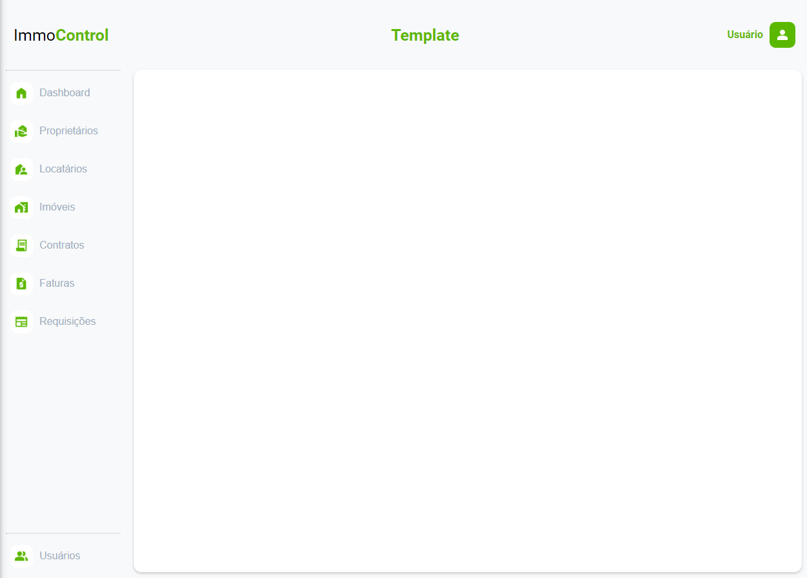
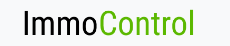

# Template padrão da Aplicação

O template padrão da aplicação foi construído com as linguagens de marcação HTML e CSS.

As telas terão como elementos padrões o menu de navegação, o header e o nav, além dos elementos de identidade visual citados abaixo:

* Cores: green (#5BB800), grey (#E0E1E2), light-gre (#F8F9FA), dark-grey (#A0AEC0), black (#000000) e white (#ffffff);                        
* Font-family: Roboto, sans-serif;
* Font-size: 25px e 16px.

O código utilizado para a construção dos elementos citados, incluindo a responsividade, pode ser consultado [aqui](https://github.com/ICEI-PUC-Minas-PMV-ADS/pmv-ads-2024-1-e1-proj-web-t6-pmv-ads-2024-1-e1-projeto_locacao/tree/main/codigo-fonte/template_page). As imagens e ícones utilizados no projeto estão disponíveis [aqui](https://github.com/ICEI-PUC-Minas-PMV-ADS/pmv-ads-2024-1-e1-proj-web-t6-pmv-ads-2024-1-e1-projeto_locacao/tree/main/codigo-fonte/src).

# Tela Padrão

Exibe a logomarca, título da página, o tipo de usuário logado e o sidebar com os respectivos botões.
<figure> 
  Figura 1 - Tela Padrão</figcaption>
</figure>  

Foi usado um tom de verde mais chamativo em detrimento ao fundo claro em alguns ícones ou links da página, estratégia usada justamente para chamar atenção e foco do usuário nos conteúdos abordados ali, bem como na logomarca, por exemplo. 

<figure> 
  Figura 2 - Logomarca</figcaption>
</figure>

