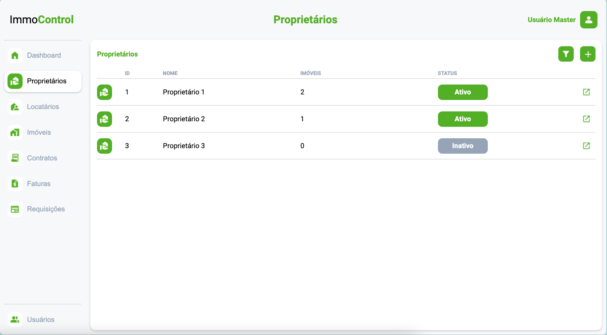

# Programação de Funcionalidades

Pré-requisitos: [Especificação do Projeto](https://github.com/ICEI-PUC-Minas-PMV-ADS/pmv-ads-2024-1-e1-proj-web-t6-pmv-ads-2024-1-e1-projeto_locacao/blob/main/documentos/02-Especificação%20do%20Projeto.md), [Metodologia](https://github.com/ICEI-PUC-Minas-PMV-ADS/pmv-ads-2024-1-e1-proj-web-t6-pmv-ads-2024-1-e1-projeto_locacao/blob/main/documentos/03-Metodologia.md), [Projeto de Interface](https://github.com/ICEI-PUC-Minas-PMV-ADS/pmv-ads-2024-1-e1-proj-web-t6-pmv-ads-2024-1-e1-projeto_locacao/blob/main/documentos/04-Projeto%20de%20Interface.md), [Template Padrão da Solução](https://github.com/ICEI-PUC-Minas-PMV-ADS/pmv-ads-2024-1-e1-proj-web-t6-pmv-ads-2024-1-e1-projeto_locacao/blob/main/documentos/05-Template%20padrão%20da%20Aplicação.md)

--------------------------------------------------------------------------------------------------------------------

### RF-01 USUÁRIOS (THÁSSIA)

#### Requisito atendido

#### Artefatos da funcionalidade

#### Estrutura de Dados

#### Instruções de acesso

#### Responsável

--------------------------------------------------------------------------------------------------------------------

### RF-02 LOGIN / PRIMEIRO ACESSO

O acesso a tela de login e primeiro acesso poderá ser feito através do menu “Entrar”. Com a inserção do e-mail cadastrado e senha padrão que será fornecida previamente. As estruturas de dados foram baseadas em HTML, CSS e JS.
Exemplo da tela de login: 
<figure> 
  Figura 2 - Tela - Login</figcaption>
</figure>

#### Requisito atendido
RF-02: A aplicação deve permitir ao usuário fazer o login em sua conta.

#### Artefatos da funcionalidade
● login_page.html  
● login_page.css 
● login_page.js 

#### Estrutura de Dados
● [login_page.html](https://github.com/ICEI-PUC-Minas-PMV-ADS/pmv-ads-2024-1-e1-proj-web-t6-pmv-ads-2024-1-e1-projeto_locacao/blob/a936b66e6ee5f9aa713dc2ea084a9a78b23a7fef/codigo-fonte/login_page/login_page.html)

#### Instruções de acesso
Abra um navegador de Internet e informe a seguinte URL: https://icei-puc-minas-pmv-ads.github.io/pmv-ads-2024-1-e1-proj-web-t6-pmv-ads-2024-1-e1-projeto_locacao/codigo-fonte/login_page/login_page.html

Ao clicar em “ENTRAR” na parte inferior, será direcionado para a tela de primeiro acesso sendo necessário a alteração da senha padrão e, portanto, a liberação de login ao sistema.

#### Responsável
Socratis Gomes da Silva

--------------------------------------------------------------------------------------------------------------------

### RF-03 IMÓVEIS (ZANDER)

#### Requisito atendido

#### Artefatos da funcionalidade

#### Estrutura de Dados

#### Instruções de acesso

#### Responsável

--------------------------------------------------------------------------------------------------------------------

### RF-04 PROPRIETÁRIOS (PEDRO)

Responsável: Pedro Francis Maia Coelho

O acesso a tela de proprietários poderá ser feito através da opção "Proproetários" no menu lateral a esquerda de qualquer página após o login.

Exemplo da tela de proprietários:
<figure> 
  Figura 4 - Tela de Proprietários</figcaption>
</figure>

#### Requisito atendido

RF-04: A aplicação deve permitir ao usuário cadastrar/alterar/pesquisar informações dos proprietários.

#### Artefatos da funcionalidade

* proprietarios_page.css
* proprietarios_page.html
* proprietarios_page.js

#### Estrutura de Dados

[proprietarios_page.html](https://github.com/ICEI-PUC-Minas-PMV-ADS/pmv-ads-2024-1-e1-proj-web-t6-pmv-ads-2024-1-e1-projeto_locacao/blob/main/codigo-fonte/proprietarios_page/proprietarios_page.html)

#### Instruções de acesso

Abra um navegador de Internet e informe a seguinte URL: https://icei-puc-minas-pmv-ads.github.io/pmv-ads-2024-1-e1-proj-web-t6-pmv-ads-2024-1-e1-projeto_locacao/codigo-fonte/proprietarios_page/proprietarios_page.html

--------------------------------------------------------------------------------------------------------------------

### RF-05 LOCATÁRIOS

Após o login o acesso a tela de gestão de inquilinos é apresentada através do menu lateral esquerdo na opção "Locatários" mostrando dados dos inquilinos.

Exemplo da Tela principal "Locatários"

<figure> 
  Figura 10 - Tela - Locatário</figcaption>
</figure>

#### Requisito atendido

RF-05: A aplicação deve permitir cadastrar/alterar/pesquisar dados dos inquilinos.
 

#### Artefatos da funcionalidade
Foram criados os seguintes artefatos:

● locatarios_page.jtml  
● locatarios_page.css  
● locatarios_page.js  

#### Estrutura de Dados
A Estrutura de dados está localizada em: [locatarios_page](https://github.com/ICEI-PUC-Minas-PMV-ADS/pmv-ads-2024-1-e1-proj-web-t6-pmv-ads-2024-1-e1-projeto_locacao/tree/main/codigo-fonte/locatarios_page)

#### Instruções de acesso

Após acessar o sistema clicar no menu lateral esquerdo clicar em "Locatários"

#### Responsável

Eduardo Wollinger

--------------------------------------------------------------------------------------------------------------------

### RF-06 CONTRATOS (ZANDER)

#### Requisito atendido

#### Artefatos da funcionalidade

#### Estrutura de Dados

#### Instruções de acesso

#### Responsável

--------------------------------------------------------------------------------------------------------------------

### RF-09 REQUISIÇÕES (ISMARLEI)

#### Requisito atendido

#### Artefatos da funcionalidade

#### Estrutura de Dados

#### Instruções de acesso

#### Responsável

--------------------------------------------------------------------------------------------------------------------

### RF-PRÓXIMA ETAPA

RF-07 FATURAS (EDUARDO)

RF-08 CONTROLE DE VENCIMENTO DE ALUGUÉIS (????)

RF-10 DASHBOARD (SÓCRATIS/PEDRO)
